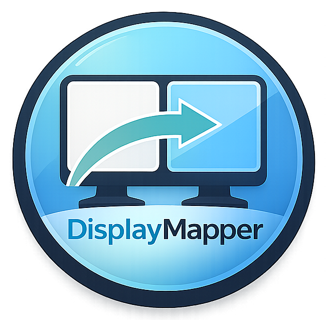
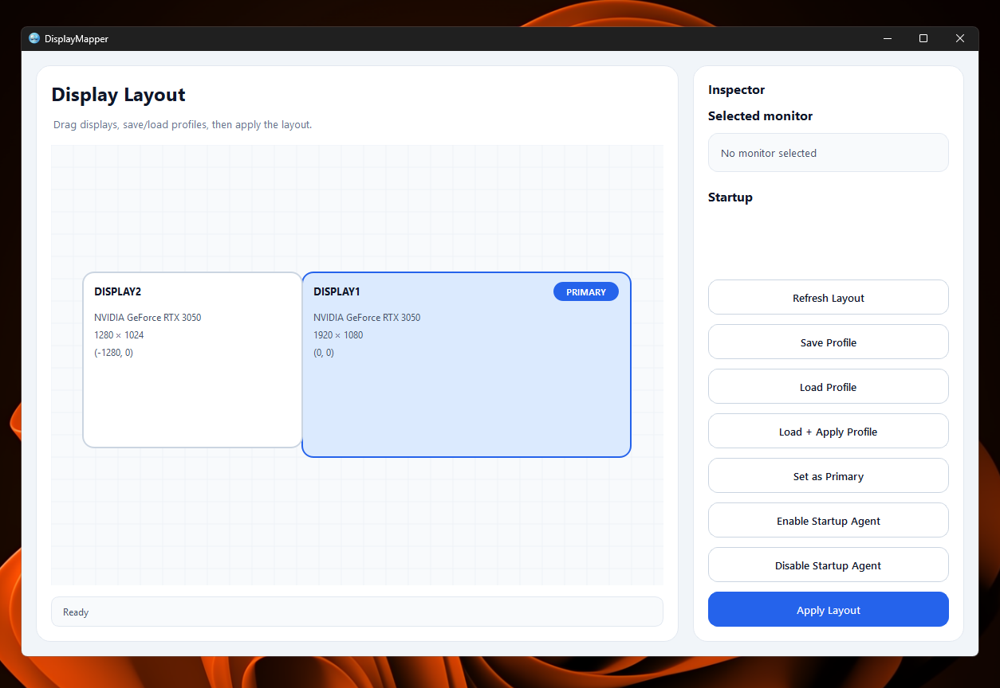

# DisplayMapper

  

DisplayMapper was created to solve a common issue experienced on some Windows systems that use multiple monitors. In certain configurations, Windows may fail to correctly detect the relative positions of connected displays. Even when the layout is configured correctly, the display arrangement may reset after a system restart, shutdown, or monitor power cycle.

DisplayMapper provides a simple visual interface that allows users to quickly position their monitors on a canvas and apply the layout instantly. In addition, the application includes a lightweight startup agent that can automatically restore the saved monitor layout immediately after a user logs into Windows. This ensures that the preferred display configuration is consistently applied without requiring manual adjustments.

---

## Screenshot

---

## Features

Visual monitor layout editor  
Arrange monitors using an intuitive drag-and-drop interface.

Profile save and load  
Save preferred monitor layouts and restore them at any time.

Primary monitor switching  
Easily change the primary display.

Startup agent  
Automatically apply a saved monitor layout when Windows starts.

Lightweight background execution  
The startup process restores the layout without launching the full graphical interface.

Multi-monitor support  
Works with standard multi-display setups including two or more monitors.

---

## How It Works

1. Launch the application.
2. Drag monitors into the desired layout.
3. Click **Apply Layout**.
4. Save the configuration if you want to reuse it later.
5. Enable the startup agent to automatically restore the layout when logging into Windows.

---

## Requirements

- Windows 10 or Windows 11
- Multi-monitor setup

---

## Notes

Behavior may vary depending on hardware configuration, GPU drivers, docking stations, or display adapters. Different monitor connection methods may influence how Windows reports display information.

---

## Repository

Source code and updates are available at:

https://github.com/canyrtcn
